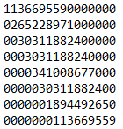
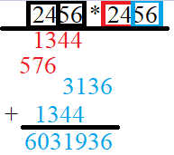
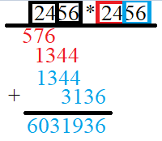
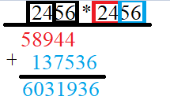

# Párhuzamos eszközök programozása beadandó

A feladat nagy számok szorzása, annak párhuzamos elvégzése videókártyán. A megoldás során a "ceruza és papír" módszert használjuk, melynek futási ideje O(n^2).

## Optimalizálás

Mivel a processzor számára két egész szám szorzása (32,64 bit) nem függ a szám nagyságától, így ugyanannyi idő alatt tudja elvégezni ezt a két műveletet: 4 \* 4 és 9 999 \* 9 999.  
Ezt kihasználva ha a ceruza és papír módszer során nem egy-egy, hanem több számjegyet tudunk egyszerre összeszorozni, csökkenthetjük a futási időt.

### Esetek

5 esetet vizsgáltam.

#### 1. Eset

A szorzás során a standard változatot használjuk. Minden számjegyen végigmegyünk a szorzó számjegyei közül, majd minden számjegyet összeszorzunk vele balról jobbra a szorzandó számban. A részeredményeket leírjuk, majd külön összeadjuk őket. Hogy egyszerűbb legyen az összeadás, a részeredményeket kétszer akkora tömbben tároljuk le, mint ami szükséges. A szükségtelen helyekre 0-kat teszünk. Tehát kb. így fognak kinézni: 
 
A számokat jobbról balra oszlopfolytonosan adjuk össze.

#### 2-4. Eset (32 bit)

A szorzást blokkokban végezzük el. Felbontjuk a számokat maximum 4 számjegyű számokra. Azért maximum 4 számjegyre bontjuk fel, mert 5 számjegy esetén 99 999 \* 99 999 = 9 999 800 001 ami nagyobb mint a 2^32-es limit az előjel nélküli 32 bites egész számok esetén. A felbontást úgy végezzük el, hogy minden blokkban ugyanannyi számjegy legyen, ez alől kivétel lehet az első blokk. Tehát ha 4 számjegyes blokkokra bontom fel a 999 999 999 számot, akkor abból [9] [9999] [9999] lesz. Ezután ezeket a blokkokat szorozzuk össze egymással, részösszegeket képezve. Ez a megoldás papíron már jóval nehezebben működik, mert mi emberek 1-1 számjegyet tudunk egyszerre szorozni. 
Az összeadás papíron annyival módosulna ha így végeznénk ez a szorzást, hogy a számokat annyival kellene eltolni, amekkora blokkokat használtunk. Tehát egy 2 nagyságú blokk esetén írásban így nézne ki a szorzás: 
 
Vagy átrendezve: 
 
A megoldás során a program az azonos színű blokkokat rögtön összeadja a szorzás során. Tehát a részösszegek így módosulnak: 
 
Az összeadások során annyiban változik a megoldás, hogy a maradékokat nem 10-el való osztással határozzuk meg, hanem (10^blokk_nagyság)-ú osztással. Tehát 4 blokk esetén ez 10000. 
Ezen megoldás során nem töltjük fel nullákkal a részösszegeket. Így az indexeléssel kell megoldani az eltolást. Ez nagyobb számok esetén jelentős különbséget okozott a futási időben a naív megoldáshoz képest, akkor is, mikor a blokkok nagysága 1 volt.  
Ezeket az eseteket 1,2,4 számjegyű blokkra vizsgáltam.

#### 5. Eset (64 bit)

Az előbbiek igazak 64 bit esetén is. Itt annyi a különbség, hogy a blokkok mérete lehet nagyobb is. Ez a maximum a 9, mert 2^64-en 19 számjegyű. Ez azt jelenti, hogy két 9 számjegyú számot biztosan lehet rajta ábrázolni. 
Ez az eset még azzal is jobb, hogy megfelelő számító egység esetén, a 64 bites szorzás csak ~1.5x lassabb, mint a 32 bites. Ez azt jelenti, hogy kétszer két 32bites számot lassabban tud összeszorozni az egység, mint egyszer két 64 bitest. Így több mint dupla annyi számjegyet tudunk egyszerre szorozni, és még a másfélszeres gyorsítást is megkapjuk. 
Ezt az esetet 9 számjegyű blokkokra vizsgáltam.

## Párhuzamosítás

Opencl-ben csak az első esetet vizsgáltam. Párhuzamosítani két helyen tudunk: 

#### Szorzási lépés

A szorzás során ki tudjuk osztani a kerneleknek a szorzó számjegyeit. Minden kernel egy számjegyet kap, majd végig szorozza a szorzandót. Így az összes részössszeget párhuzamosan megkapjuk.

#### Összeadási lépés

A részösszegeket is össze tudjuk - majdnem teljesen - adni. Minden kernel megkapja a saját id-jához tartozó oszlopot az összeadás során. Az oszlopban lévő összes számot összeadja, a tízes maradékot beleteszi az eredmény tömbbe, a maradékot egy maradék tömbbe. 
Annyiban nehezedik a feladat, hogy ha a szorzó számjegyeinek száma N, akkor N kernelünk van. Ha a szorzandó számjegyeinek a száma K, akkor N+K oszlopunk van. Így ezt a lépést kétszer kell elvégezni, egy id eltolással, figyelve arra, hogy ne csorduljun túl az indexünk a tömbbön. 
Visszakérjük az eredmény tömböt és a maradék tömböt a GPU-tól, majd azt egy index eltolással összeadjuk, figyelve itt is a maradékokra.  

Így a legtöbb műveletet a kernel végzi el, és csak egyszer küldjük oda és vissza az adatokat. A host program csak a számok feldarabolását, az átküldést, majd két nagy szám összeadását végzi.

## Mérések

A mérések a meresek.xls fájlban láthatóak. A mérések során összehasonlítottam a megoldást a Karatsuba módszerrel, aminek futási ideje ~ O(n^1,58). Ez az algoritmus jóval gyorsabban futott kisebb és nagyobb nagyságrendű számok esetén is.
